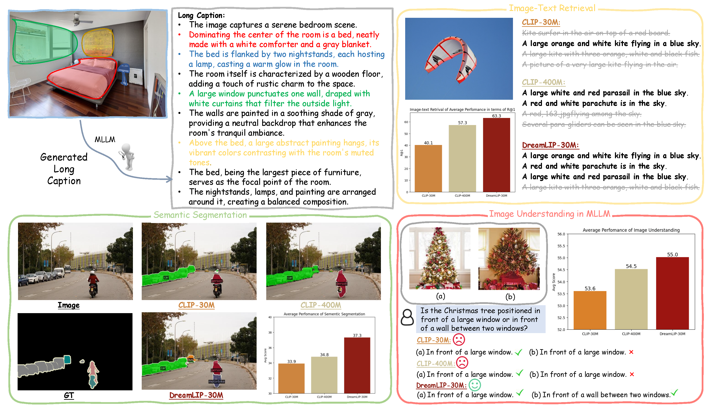

# DreamLIP: Language-Image Pre-training with Long Captions
Official repo for [DreamLIP: Language-Image Pre-training with Long Captions]().




> **DreamLIP: Language-Image Pre-training with Long Captions** <br>

[//]: # (> [Kecheng Zheng]&#40;https://zkcys001.github.io/&#41;, [Yujun Shen]&#40;https://shenyujun.github.io/&#41; <br>)
[//]: # (> **xxx Track** <br>)

[[Paper](https://arxiv.org/pdf/2403.17007.pdf)]

## Overview of supported long captions:

<details open>
<summary><b>Long Captions of Supported Datasets (5)</b></summary>

> - [x] [](https://ai.google.com/research/ConceptualCaptions/)
> - [x] [](https://github.com/google-research-datasets/conceptual-12m)
> - [x] [](https://github.com/Sense-GVT/DeCLIP/blob/main/docs/dataset_prepare.md)
> - [ ] [](https://laion.ai/laion-5b-a-new-era-of-open-large-scale-multi-modal-datasets/)
> - [ ] [](https://github.com/kakaobrain/coyo-dataset)
</details>
<details open>
<summary><b>Long Captions of MLLMs (3)</b></summary>

> - [x]  
> - [x]  
> - [x]  

</details>

## TODO

- [ ] Release code.
- [ ] Release weights.
- [ ] Release long caption extracted from LLAVA1.5, InstructBLIP and shareGPT4V.

[//]: # (## Acknowledgement)

## BibTeX

```bibtex
@article{DreamLIP,
  title={DreamLIP: Language-Image Pre-training with Long Captions},
  author={Zheng, Kecheng and Zhang, Yifei and Wu, Wei and Lu, Fan and Ma, Shuailei and Jin, Xin and Chen, Wei and Shen, Yujun},
  journal={arXiv:2403.17007},
  year={2024}
}
```

