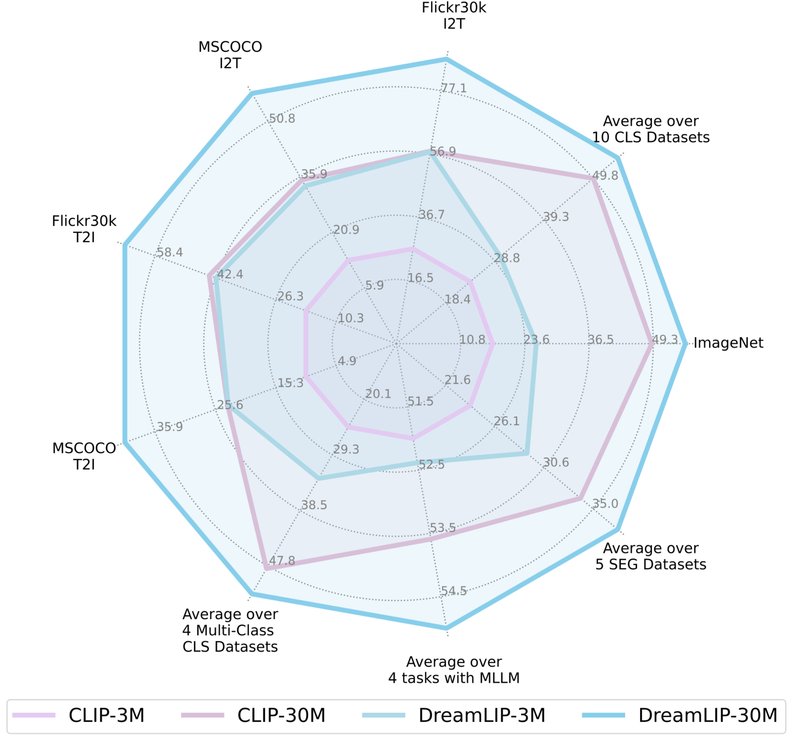

# DreamLIP: Language-Image Pre-training with Long Captions


> **DreamLIP: Language-Image Pre-training with Long Captions** <br>
<a href="https://zkcys001.github.io/">Kecheng Zheng</a>,</span>
<a href="https://github.com/zyf0619sjtu">Yifei Zhang</a>,</span>
<a href="https://github.com/wuw2019">Wei Wu</a>,</span>
<a href="https://github.com/LuFan31">Fan Lu</a>,</span>
<a href="https://scholar.google.com/citations?user=dNhzCu4AAAAJ&hl=zh-CN">Shuailei Ma</a>,</span>
<a href="http://home.ustc.edu.cn/~jinxustc/">Xin Jin</a>,</span>
<a href="http://www.cad.zju.edu.cn/home/chenwei/">Wei Chen</a>,</span>
<a href="https://shenyujun.github.io/">Yujun Shen</a> <br>
[Project Page](https://zyf0619sjtu.github.io/dream-lip/) | [Paper](https://arxiv.org/pdf/2403.17007.pdf) | [Data](https://drive.google.com/file/d/19jCNWvy7kA70u-ufQtEJvbKVMG2b8MnP/view?usp=drive_link)


## 📰 News

- [2024/03/27] Long captions (LLAVA1.5, InstructBLIP and shareGPT4V) of CC3M are released <a href="https://drive.google.com/file/d/19jCNWvy7kA70u-ufQtEJvbKVMG2b8MnP/view?usp=drive_link">here</a>~

## 💡 Highlights
- 🔥 Exploring how language-image pre-training could benefit from long captions.
- 🔥 Strong improvement on semantic segmentation, image-text retrieval, semantic segmentation, and image understanding in MLLM.



- 🔥 DreamLIP trained with 30M image-text pairs achieves on par or even better performance than CLIP trained with 400M pairs.


## 🎨 In-Progress

- [X] We have released long captions of CC3M.
- [ ] Release long captions of CC12M, YFCC15M, Laion20M, and COYO4M.
- [ ] Upload the pretrained weight of VIT-B/16 and VIT-B/32 pretrained in CC3M, CC12M, YFCC15M, and merged-30M.
- [ ] Release evaluation code
- [ ] Release training code

## 🏝️ Overview of supported long captions:

<details open>
<summary><b>Long Captions of Supported Datasets (5)</b></summary>

> - [x] [](https://ai.google.com/research/ConceptualCaptions/)
> - [x] [](https://github.com/google-research-datasets/conceptual-12m)
> - [x] [](https://github.com/Sense-GVT/DeCLIP/blob/main/docs/dataset_prepare.md)
> - [ ] [](https://laion.ai/laion-5b-a-new-era-of-open-large-scale-multi-modal-datasets/)
> - [ ] [](https://github.com/kakaobrain/coyo-dataset)
</details>
<details open>
<summary><b>Long Captions of MLLMs (3)</b></summary>

> - [x]  
> - [x]  
> - [x]  

</details>

[//]: # (## Acknowledgement)


### Generated Long Captions

<table><tbody>
<!-- START TABLE -->
<!-- TABLE HEADER -->
<th valign="center">Dataset</th>
<th valign="center">Raw</th>
<th valign="center">InstructBLIP</th>
<th valign="center">LLAVA1.5</th>
<th valign="center">ShareGPT4V</th>
<th valign="center">ALL</th>

<!-- TABLE BODY -->
<tr>
<td align="center">CC3M</td>
<td align="center">TODO</td>
<td align="center">TODO</td>
<td align="center">TODO</td>
<td align="center">TODO</td>
<td align="center"><a href="https://drive.google.com/file/d/19jCNWvy7kA70u-ufQtEJvbKVMG2b8MnP/view?usp=drive_link">Link</a></td>
</tr>
<tr>
<td align="center">CC12M</td>
<td align="center">TODO</td>
<td align="center">TODO</td>
<td align="center">TODO</td>
<td align="center">TODO</td>
<td align="center">TODO</td>
</tr>
<tr>
<td align="center">YFCC15M</td>
<td align="center">TODO</td>
<td align="center">TODO</td>
<td align="center">TODO</td>
<td align="center">TODO</td>
<td align="center">TODO</td>
</tr>
</tbody></table>

## Pretrained checkpoints
TODO

[//]: # (You can download checkpoints pre-trained )


## 📖 Citation

```bibtex
@article{DreamLIP,
  title={DreamLIP: Language-Image Pre-training with Long Captions},
  author={Zheng, Kecheng and Zhang, Yifei and Wu, Wei and Lu, Fan and Ma, Shuailei and Jin, Xin and Chen, Wei and Shen, Yujun},
  journal={arXiv:2403.17007},
  year={2024}
}
```

### Acknowledgements
We thank [InstructBLIP](https://github.com/salesforce/LAVIS), [ShareGPT4V](https://github.com/InternLM/InternLM-XComposer) and [LLAVA](https://github.com/haotian-liu/LLaVA) for the pretrained models and codes.
